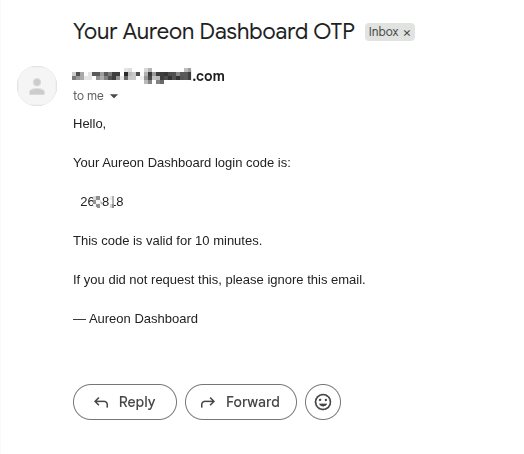

# Aureon - Finance Dashboard Backend — Complete Technical Documentation

> **Version:** 1.0.0 | **Stack:** Java 21 · Spring Boot 3.2 · PostgreSQL · JWT · Flyway
> **Last Updated:** 2025

---

## Table of Contents

1. [Project Overview](#1-project-overview)
2. [Architecture](#2-architecture)
   - 2.1 [Package Structure](#21-package-structure)
   - 2.2 [Layer Responsibilities](#22-layer-responsibilities)
   - 2.3 [Request Lifecycle](#23-request-lifecycle)
3. [Authentication System](#3-authentication-system)
   - 3.1 [OTP Flow](#31-otp-flow)
   - 3.2 [JWT Design](#32-jwt-design)
   - 3.3 [Security Filter Chain](#33-security-filter-chain)
4. [Role-Based Access Control](#4-role-based-access-control)
   - 4.1 [Role Definitions](#41-role-definitions)
   - 4.2 [Permission Matrix](#42-permission-matrix)
   - 4.3 [Enforcement Strategy](#43-enforcement-strategy)
5. [Data Model](#5-data-model)
   - 5.1 [Entity Relationship Diagram](#51-entity-relationship-diagram)
   - 5.2 [Users Table](#52-users-table)
   - 5.3 [OTP Tokens Table](#53-otp-tokens-table)
   - 5.4 [Financial Records Table](#54-financial-records-table)
   - 5.5 [Enumerations](#55-enumerations)
6. [API Reference](#6-api-reference)
   - 6.1 [Authentication APIs](#61-authentication-apis)
   - 6.2 [Dashboard APIs](#62-dashboard-apis)
   - 6.3 [Financial Records APIs](#63-financial-records-apis)
   - 6.4 [User Management APIs](#64-user-management-apis)
   - 6.5 [Common Response Shapes](#65-common-response-shapes)
   - 6.6 [Error Responses](#66-error-responses)
7. [Service Layer](#7-service-layer)
   - 7.1 [AuthService](#71-authservice)
   - 7.2 [UserService](#72-userservice)
   - 7.3 [FinancialRecordService](#73-financialrecordservice)
   - 7.4 [DashboardService](#74-dashboardservice)
   - 7.5 [EmailService](#75-emailservice)
8. [Database & Migrations](#8-database--migrations)
   - 8.1 [Flyway Strategy](#81-flyway-strategy)
   - 8.2 [Migration Files](#82-migration-files)
   - 8.3 [Indexes](#83-indexes)
9. [Soft Delete](#9-soft-delete)
10. [Filtering & Pagination](#10-filtering--pagination)
    - 10.1 [Specification Pattern](#101-specification-pattern)
    - 10.2 [Pagination Parameters](#102-pagination-parameters)
11. [Configuration Reference](#11-configuration-reference)
    - 11.1 [application.yml Explained](#111-applicationyml-explained)
    - 11.2 [Environment Variables](#112-environment-variables)
12. [Setup & Running](#12-setup--running)
    - 12.1 [Prerequisites](#121-prerequisites)
    - 12.2 [Local Setup Step-by-Step](#122-local-setup-step-by-step)
    - 12.3 [First-Time Login](#123-first-time-login)
13. [Testing](#13-testing)
    - 13.1 [Test Strategy](#131-test-strategy)
    - 13.2 [Test Configuration](#132-test-configuration)
    - 13.3 [Test Coverage Summary](#133-test-coverage-summary)
    - 13.4 [Running Tests](#134-running-tests)
14. [Design Decisions & Trade-offs](#14-design-decisions--trade-offs)
15. [Security Considerations](#15-security-considerations)
16. [Assumptions](#16-assumptions)
17. [Potential Enhancements](#17-potential-enhancements)
18. [Glossary](#18-glossary)

---

## 1. Project Overview

The Aureon Finance Dashboard Backend is a RESTful API service designed to power an internal finance dashboard. It provides:

- **Passwordless authentication** via email OTP, issuing JWT tokens on successful verification
- **Role-based access control** with three distinct roles (VIEWER, ANALYST, ADMIN)
- **Financial record management** — create, read, update, and soft-delete income/expense entries
- **Dashboard analytics** — aggregated summaries, category breakdowns, monthly trends, and recent activity
- **User management** — admin-controlled user provisioning and role assignment

The system is intentionally designed for **internal/invite-only use**. Users cannot self-register. An admin must create all accounts, and users authenticate only via OTP sent to their registered email.

---

## 2. Architecture

### 2.1 Package Structure

```
com.aureon.backend/
│
├── config/
│   ├── AppProperties.java          # Typed config binding (JWT, OTP settings)
│   ├── JpaConfig.java              # Enables JPA auditing (@CreatedDate, @LastModifiedDate)
│   ├── OpenApiConfig.java          # Swagger/OpenAPI 3 setup with JWT security scheme
│   └── SecurityConfig.java         # Spring Security filter chain + URL-level RBAC rules
│
├── controller/
│   ├── AuthController.java         # POST /api/v1/auth/send-otp, /verify-otp
│   ├── DashboardController.java    # GET  /api/v1/dashboard/**
│   ├── FinancialRecordController.java # CRUD /api/v1/records/**
│   └── UserController.java         # CRUD /api/v1/users/**
│
├── dto/
│   ├── request/
│   │   ├── AuthRequests.java       # SendOtpRequest, VerifyOtpRequest
│   │   ├── RecordRequests.java     # CreateRecordRequest, UpdateRecordRequest
│   │   └── UserRequests.java       # CreateUserRequest, UpdateUserRequest
│   └── response/
│       └── Responses.java          # All response records: Auth, User, Record, Dashboard, Paged
│
├── entity/
│   ├── FinancialRecord.java        # financial_records table
│   ├── OtpToken.java               # otp_tokens table
│   └── User.java                   # users table
│
├── enums/
│   ├── Role.java                   # VIEWER | ANALYST | ADMIN
│   ├── TransactionType.java        # INCOME | EXPENSE
│   └── UserStatus.java             # ACTIVE | INACTIVE
│
├── exception/
│   ├── BadRequestException.java    # 400
│   ├── ConflictException.java      # 409
│   ├── GlobalExceptionHandler.java # @RestControllerAdvice — maps all exceptions to JSON
│   ├── ResourceNotFoundException.java # 404
│   └── UnauthorizedException.java  # 401
│
├── repository/
│   ├── FinancialRecordRepository.java      # JPA repo + custom aggregation queries
│   ├── FinancialRecordSpecification.java   # Dynamic filtering via JPA Specification
│   ├── OtpTokenRepository.java             # OTP lookup + bulk invalidation
│   └── UserRepository.java                 # User lookup by email, status, role
│
├── security/
│   ├── AuthenticatedUser.java      # Principal object stored in SecurityContext
│   ├── JwtAuthFilter.java          # OncePerRequestFilter — extracts and validates JWT
│   └── JwtUtils.java               # Token generation, parsing, validation
│
├── service/
│   ├── AuthService.java            # Interface
│   ├── DashboardService.java       # Interface
│   ├── EmailService.java           # Interface
│   ├── FinancialRecordService.java # Interface
│   ├── UserService.java            # Interface
│   └── impl/
│       ├── AuthServiceImpl.java
│       ├── DashboardServiceImpl.java
│       ├── EmailServiceImpl.java
│       ├── FinancialRecordServiceImpl.java
│       └── UserServiceImpl.java
│
├── util/
│   └── OtpGenerator.java           # Cryptographically secure OTP generation
│
└── FinanceBackendApplication.java  # Entry point, enables @Scheduling
```

### 2.2 Layer Responsibilities

```
┌─────────────────────────────────────────────────────┐
│                    HTTP Client                       │
└────────────────────────┬────────────────────────────┘
                         │ HTTP Request
┌────────────────────────▼────────────────────────────┐
│              Security Filter Chain                   │
│   JwtAuthFilter → extracts JWT → sets SecurityContext│
└────────────────────────┬────────────────────────────┘
                         │
┌────────────────────────▼────────────────────────────┐
│                   Controllers                        │
│  - Parse & validate HTTP input (via @Valid)          │
│  - Extract authenticated principal                   │
│  - Delegate to service layer                         │
│  - Return ResponseEntity with appropriate status     │
└────────────────────────┬────────────────────────────┘
                         │
┌────────────────────────▼────────────────────────────┐
│                  Service Layer                       │
│  - All business logic lives here                     │
│  - Transactional boundaries (@Transactional)         │
│  - Throws domain exceptions on invalid states        │
│  - Maps entities ↔ DTOs                              │
└────────────────────────┬────────────────────────────┘
                         │
┌────────────────────────▼────────────────────────────┐
│                Repository Layer                      │
│  - Spring Data JPA interfaces                        │
│  - Custom JPQL and native SQL queries                │
│  - JPA Specification for dynamic queries             │
└────────────────────────┬────────────────────────────┘
                         │
┌────────────────────────▼────────────────────────────┐
│              PostgreSQL Database                     │
│  Schema managed by Flyway migrations                 │
└─────────────────────────────────────────────────────┘
```

### 2.3 Request Lifecycle

Below is the complete lifecycle of an authenticated API request:

```
1.  Client sends:   GET /api/v1/records?type=INCOME
                    Authorization: Bearer eyJhbGci...

2.  JwtAuthFilter intercepts the request:
      a. Extracts token from Authorization header
      b. Validates signature, expiry via JwtUtils
      c. Extracts email, role, userId from claims
      d. Loads User from DB, checks isActive()
      e. Creates UsernamePasswordAuthenticationToken
      f. Sets it on SecurityContextHolder

3.  SecurityConfig URL rules checked:
      GET /api/v1/records/** → requires ROLE_ANALYST or ROLE_ADMIN
      User has ROLE_ANALYST → allowed

4.  FinancialRecordController.getRecords() is called:
      a. Reads query params (type, category, from, to, search, page, size)
      b. Calls recordService.getRecords(...)

5.  FinancialRecordServiceImpl.getRecords():
      a. Builds a JPA Specification from provided filters
      b. Calls recordRepository.findAll(spec, pageable)
      c. Maps FinancialRecord entities → RecordResponse DTOs
      d. Wraps in PagedResponse

6.  Controller returns:
      HTTP 200 OK
      Content-Type: application/json
      Body: { content: [...], page: 0, size: 20, totalElements: 42, ... }
```

---

## 3. Authentication System

### 3.1 OTP Flow
The system uses a **passwordless, OTP-based** authentication model. No passwords are stored anywhere in the database.

```
┌──────────┐         ┌─────────────────┐         ┌──────────────┐       ┌─────────┐
│  Client  │         │  AuthController │         │  AuthService │       │  Gmail  │
└────┬─────┘         └──────┬──────────┘         └───┬──────────┘       └─┬───────┘
     │                      │                        │                    │
     │  POST /send-otp      │                        │                    │
     │  { email }           │                        │                    │
     │─────────────────────►│                        │                    │
     │                      │  sendOtp(request)      │                    │
     │                      │───────────────────────►│                    │
     │                      │                        │ findByEmail()      │
     │                      │                        │ verify ACTIVE      │
     │                      │                        │ invalidate old OTPs│
     │                      │                        │ generate 6-digit   │
     │                      │                        │ persist OtpToken   │
     │                      │                        │                    │
     │                      │                        │  sendOtp(email,otp)│
     │                      │                        │───────────────────►│
     │                      │                        │                    │ send email
     │  200 { message }     │                        │◄───────────────────│
     │◄─────────────────────│                        │                    │
     │                      │                        │                    │
     │  POST /verify-otp    │                        │                    │
     │  { email, otp }      │                        │                    │
     │─────────────────────►│                        │                    │
     │                      │  verifyOtp(request)    │                    │
     │                      │───────────────────────►│                    │
     │                      │                        │ find latest unused │
     │                      │                        │ check expiry       │
     │                      │                        │ compare otp value  │
     │                      │                        │ mark used=true     │
     │                      │                        │ generate JWT       │
     │  200 { token, user } │                        │                    │
     │◄─────────────────────│                        │                    │
```

**OTP lifecycle rules:**

- OTPs are **6 digits**, generated using `SecureRandom` (cryptographically secure)
- Valid for **10 minutes** (configurable via `app.otp.expiry-minutes`)
- **Single-use** — marked `used=true` immediately on successful verification
- Requesting a new OTP **invalidates all previous** unused OTPs for that email via `invalidateAllForEmail()`
- Expired tokens are purged nightly by a `@Scheduled` cleanup job at 2:00 AM

### 3.2 JWT Design

On successful OTP verification, a **signed JWT** is issued.

**Token structure (claims):**

```json
{
  "sub": "user@example.com",
  "role": "ANALYST",
  "userId": 42,
  "iat": 1712000000,
  "exp": 1712086400
}
```

| Claim | Description |
|---|---|
| `sub` | User's email address |
| `role` | User's current role (VIEWER, ANALYST, ADMIN) |
| `userId` | Database primary key — used to load user context |
| `iat` | Issued-at timestamp |
| `exp` | Expiry timestamp (default: 24 hours after issue) |

**Why embed `role` in the token?**
The role is embedded so that authorization checks in `SecurityConfig` and `@PreAuthorize` do not require a database lookup on every request. The trade-off is that role changes do not take immediate effect — a user's existing token continues to reflect the old role until it expires. For a 24-hour expiry this is an acceptable trade-off; for more sensitive scenarios consider shorter expiry or a token revocation list.

**Signing algorithm:** HMAC-SHA256 (`HS256`) using a secret key loaded from the `app.jwt.secret` environment variable.

### 3.3 Security Filter Chain

`JwtAuthFilter` extends `OncePerRequestFilter`, guaranteeing it runs exactly once per request regardless of forward/include chains.

```java
// Execution order in SecurityConfig:
UsernamePasswordAuthenticationFilter
        ↑
JwtAuthFilter (added before ↑)
```

Filter logic:

1. If `Authorization` header is absent or not `Bearer ...` → skip (public endpoint or will be rejected downstream)
2. Extract token string, call `jwtUtils.isTokenValid(token)`
3. If invalid → skip (SecurityContext remains empty, request will be rejected by access rules)
4. Extract `email` from claims, load `User` from DB
5. Check `user.isActive()` — inactive users are rejected even with a valid token
6. Build `UsernamePasswordAuthenticationToken` with `AuthenticatedUser` as the principal
7. Set on `SecurityContextHolder`

---

## 4. Role-Based Access Control

### 4.1 Role Definitions

| Role | Description | Typical User |
|---|---|---|
| `VIEWER` | Read-only access to dashboard summaries | Executive, stakeholder |
| `ANALYST` | Read dashboard + view full record details | Aureon analyst, auditor |
| `ADMIN` | Full access: create/edit/delete records and manage users | Aureon manager, system admin |

### 4.2 Permission Matrix

| Action | VIEWER | ANALYST | ADMIN |
|---|:---:|:---:|:---:|
| GET /dashboard/summary | ✓ | ✓ | ✓ |
| GET /dashboard/categories | ✓ | ✓ | ✓ |
| GET /dashboard/trends | ✓ | ✓ | ✓ |
| GET /dashboard/recent | ✓ | ✓ | ✓ |
| GET /records (list) | ✗ | ✓ | ✓ |
| GET /records/:id | ✗ | ✓ | ✓ |
| POST /records | ✗ | ✗ | ✓ |
| PATCH /records/:id | ✗ | ✗ | ✓ |
| DELETE /records/:id | ✗ | ✗ | ✓ |
| GET /users | ✗ | ✗ | ✓ |
| POST /users | ✗ | ✗ | ✓ |
| PATCH /users/:id | ✗ | ✗ | ✓ |
| DELETE /users/:id | ✗ | ✗ | ✓ |

### 4.3 Enforcement Strategy

Access control is enforced at **two levels**:

**Level 1 — URL-level in `SecurityConfig`:**

```java
.requestMatchers(HttpMethod.GET, "/api/v1/dashboard/**")
    .hasAnyRole("VIEWER", "ANALYST", "ADMIN")

.requestMatchers(HttpMethod.POST, "/api/v1/records/**")
    .hasRole("ADMIN")
```

This is the primary enforcement layer. Unauthorized requests are rejected before they reach the controller.

**Level 2 — Method-level `@PreAuthorize` on controllers:**

```java
@PreAuthorize("hasRole('ADMIN')")
public class UserController { ... }
```

This provides defense-in-depth. Even if a URL rule were misconfigured, the method-level check acts as a backstop.

Spring Security translates `hasRole("ADMIN")` to match the granted authority `"ROLE_ADMIN"`, which is set during JWT filter processing:

```java
new SimpleGrantedAuthority("ROLE_" + role)
```

---

## 5. Data Model

### 5.1 Entity Relationship Diagram

```
┌──────────────────────┐          ┌──────────────────────────┐
│        users         │          │     financial_records    │
├──────────────────────┤          ├──────────────────────────┤
│ id          BIGSERIAL│◄─────────┤ created_by    BIGINT FK  │
│ email       VARCHAR  │    ┌────►│ updated_by    BIGINT FK  │
│ name        VARCHAR  │    │     │ id            BIGSERIAL  │
│ role        ENUM     │    │     │ amount        NUMERIC    │
│ status      ENUM     │────┘     │ type          ENUM       │
│ created_at  TIMESTAMP│          │ category      VARCHAR    │
│ updated_at  TIMESTAMP│          │ record_date   DATE       │
│ deleted_at  TIMESTAMP│          │ notes         TEXT       │
└──────────────────────┘          │ created_at    TIMESTAMP  │
                                  │ updated_at    TIMESTAMP  │
                                  │ deleted_at    TIMESTAMP  │
┌──────────────────────┐          └──────────────────────────┘
│     otp_tokens       │
├──────────────────────┤
│ id          BIGSERIAL│
│ email       VARCHAR  │
│ otp         VARCHAR  │
│ expires_at  TIMESTAMP│
│ used        BOOLEAN  │
│ created_at  TIMESTAMP│
└──────────────────────┘
```

### 5.2 Users Table

```sql
CREATE TABLE users (
    id          BIGSERIAL PRIMARY KEY,
    email       VARCHAR(255) NOT NULL UNIQUE,
    name        VARCHAR(100) NOT NULL,
    role        user_role    NOT NULL DEFAULT 'VIEWER',
    status      user_status  NOT NULL DEFAULT 'ACTIVE',
    created_at  TIMESTAMP    NOT NULL DEFAULT NOW(),
    updated_at  TIMESTAMP    NOT NULL DEFAULT NOW(),
    deleted_at  TIMESTAMP                            -- NULL = not deleted
);
```

| Column | Type | Constraints | Notes |
|---|---|---|---|
| `id` | BIGSERIAL | PK | Auto-increment |
| `email` | VARCHAR(255) | NOT NULL, UNIQUE | Lowercased before storage |
| `name` | VARCHAR(100) | NOT NULL | Display name |
| `role` | ENUM | NOT NULL, DEFAULT VIEWER | Determines access level |
| `status` | ENUM | NOT NULL, DEFAULT ACTIVE | INACTIVE blocks login |
| `created_at` | TIMESTAMP | NOT NULL | Set by JPA auditing |
| `updated_at` | TIMESTAMP | NOT NULL | Set by JPA auditing |
| `deleted_at` | TIMESTAMP | nullable | Non-null = soft deleted |

### 5.3 OTP Tokens Table

```sql
CREATE TABLE otp_tokens (
    id          BIGSERIAL PRIMARY KEY,
    email       VARCHAR(255) NOT NULL,
    otp         VARCHAR(10)  NOT NULL,
    expires_at  TIMESTAMP    NOT NULL,
    used        BOOLEAN      NOT NULL DEFAULT FALSE,
    created_at  TIMESTAMP    NOT NULL DEFAULT NOW()
);
```

| Column | Type | Notes |
|---|---|---|
| `email` | VARCHAR(255) | Not a FK — allows tokens for emails before user lookup |
| `otp` | VARCHAR(10) | Plain text 6-digit code (short-lived, no value in hashing) |
| `expires_at` | TIMESTAMP | `created_at + otp.expiry-minutes` |
| `used` | BOOLEAN | Set to TRUE after successful verification |

**Why is OTP stored as plain text?**
OTPs are valid for only 10 minutes and are single-use. Hashing them would add computational cost with negligible security benefit — the OTP itself is already a short-lived secret with a narrow attack window.

### 5.4 Financial Records Table

```sql
CREATE TABLE financial_records (
    id          BIGSERIAL PRIMARY KEY,
    amount      NUMERIC(15, 2) NOT NULL,
    type        transaction_type NOT NULL,
    category    VARCHAR(100)   NOT NULL,
    record_date DATE           NOT NULL,
    notes       TEXT,
    created_by  BIGINT         NOT NULL REFERENCES users(id),
    updated_by  BIGINT         REFERENCES users(id),
    created_at  TIMESTAMP      NOT NULL DEFAULT NOW(),
    updated_at  TIMESTAMP      NOT NULL DEFAULT NOW(),
    deleted_at  TIMESTAMP
);
```

| Column | Type | Notes |
|---|---|---|
| `amount` | NUMERIC(15,2) | Supports values up to 9,999,999,999,999.99 |
| `type` | ENUM | INCOME or EXPENSE |
| `category` | VARCHAR(100) | Free-form (e.g. "Salary", "Rent", "Software") |
| `record_date` | DATE | The business date of the transaction, not insertion time |
| `notes` | TEXT | Optional free-form description |
| `created_by` | FK → users | The admin who created the record |
| `updated_by` | FK → users | The admin who last modified it (nullable) |

### 5.5 Enumerations

PostgreSQL native `ENUM` types are used for type safety at the database level:

```sql
CREATE TYPE user_role        AS ENUM ('VIEWER', 'ANALYST', 'ADMIN');
CREATE TYPE user_status      AS ENUM ('ACTIVE', 'INACTIVE');
CREATE TYPE transaction_type AS ENUM ('INCOME', 'EXPENSE');
```

Hibernate maps these via `@Enumerated(EnumType.STRING)` with a `columnDefinition` hint to match the PostgreSQL type name.

---

## 6. API Reference

All endpoints are versioned under `/api/v1/`. Authenticate by including:

```
Authorization: Bearer <your-jwt-token>
```

### 6.1 Authentication APIs

These endpoints are **public** (no authentication required).

---

#### `POST /api/v1/auth/send-otp`

Request a one-time password for the given email. The user must already exist in the system (created by an admin).

**Request Body:**

```json
{
  "email": "user@example.com"
}
```

**Success Response — `200 OK`:**

```json
{
  "message": "OTP sent to user@example.com. Valid for 10 minutes."
}
```

**Error Responses:**

| Status | Condition |
|---|---|
| 400 | Email format invalid |
| 400 | Account is inactive |
| 404 | No account found for this email |
| 500 | Gmail SMTP failure |

---

#### `POST /api/v1/auth/verify-otp`

Verify the OTP and receive a JWT token.

**Request Body:**

```json
{
  "email": "user@example.com",
  "otp": "482910"
}
```

**Success Response — `200 OK`:**

```json
{
  "token": "eyJhbGciOiJIUzI1NiJ9...",
  "tokenType": "Bearer",
  "user": {
    "id": 1,
    "email": "user@example.com",
    "name": "Alice",
    "role": "ANALYST"
  }
}
```

**Error Responses:**

| Status | Condition |
|---|---|
| 400 | Validation error (blank email or OTP) |
| 401 | No active OTP found |
| 401 | OTP has expired |
| 401 | Incorrect OTP value |

---

### 6.2 Dashboard APIs

**Required role:** VIEWER, ANALYST, or ADMIN

---

#### `GET /api/v1/dashboard/summary`

Returns high-level financial totals.

**Response — `200 OK`:**

```json
{
  "totalIncome":   125000.00,
  "totalExpenses":  48500.00,
  "netBalance":    76500.00,
  "totalRecords":  143
}
```

---

#### `GET /api/v1/dashboard/categories`

Returns totals grouped by category and transaction type, sorted by total descending.

**Response — `200 OK`:**

```json
[
  { "category": "Salary",       "type": "INCOME",  "total": 90000.00 },
  { "category": "Consulting",   "type": "INCOME",  "total": 35000.00 },
  { "category": "Rent",         "type": "EXPENSE", "total": 24000.00 },
  { "category": "Software",     "type": "EXPENSE", "total": 12000.00 }
]
```

---

#### `GET /api/v1/dashboard/trends`

Returns monthly income and expense totals. Defaults to the last 12 months if no dates are provided.

**Query Parameters:**

| Parameter | Type | Required | Default | Description |
|---|---|---|---|---|
| `from` | `yyyy-MM-dd` | No | 12 months ago | Start of date range |
| `to` | `yyyy-MM-dd` | No | today | End of date range |

**Example:** `GET /api/v1/dashboard/trends?from=2024-01-01&to=2024-06-30`

**Response — `200 OK`:**

```json
[
  { "year": 2024, "month": 1, "type": "INCOME",  "total": 10000.00 },
  { "year": 2024, "month": 1, "type": "EXPENSE", "total":  4200.00 },
  { "year": 2024, "month": 2, "type": "INCOME",  "total": 10000.00 },
  { "year": 2024, "month": 2, "type": "EXPENSE", "total":  3800.00 }
]
```

---

#### `GET /api/v1/dashboard/recent`

Returns the N most recently created financial records.

**Query Parameters:**

| Parameter | Type | Default | Constraints |
|---|---|---|---|
| `limit` | int | 10 | Clamped to 1–50 |

**Response — `200 OK`:** Array of `RecordResponse` (see [§6.5](#65-common-response-shapes))

---

### 6.3 Financial Records APIs

**GET endpoints:** ANALYST or ADMIN
**POST / PATCH / DELETE:** ADMIN only

---

#### `GET /api/v1/records`

Paginated, filterable list of financial records.

**Query Parameters:**

| Parameter | Type | Description |
|---|---|---|
| `type` | `INCOME` \| `EXPENSE` | Filter by transaction type |
| `category` | string | Partial, case-insensitive match on category |
| `from` | `yyyy-MM-dd` | Record date ≥ from |
| `to` | `yyyy-MM-dd` | Record date ≤ to |
| `search` | string | Searches category AND notes (partial, case-insensitive) |
| `page` | int (default 0) | Zero-based page number |
| `size` | int (default 20) | Page size |
| `sortBy` | string (default `recordDate`) | Field to sort by |
| `direction` | `asc` \| `desc` (default `desc`) | Sort direction |

**Example:** `GET /api/v1/records?type=EXPENSE&category=rent&from=2024-01-01&page=0&size=10`

**Response — `200 OK`:**

```json
{
  "content": [ /* array of RecordResponse */ ],
  "page": 0,
  "size": 10,
  "totalElements": 24,
  "totalPages": 3,
  "last": false
}
```

---

#### `GET /api/v1/records/{id}`

Fetch a single record by ID.

**Response — `200 OK`:** Single `RecordResponse`
**Error:** `404` if not found or soft-deleted

---

#### `POST /api/v1/records`

Create a new financial record. The authenticated user is recorded as `createdBy`.

**Request Body:**

```json
{
  "amount":     4500.00,
  "type":       "EXPENSE",
  "category":   "Office Rent",
  "recordDate": "2024-03-01",
  "notes":      "Q1 office rent payment"
}
```

**Validation Rules:**

- `amount`: required, > 0, max 13 integer digits + 2 decimal places
- `type`: required, must be `INCOME` or `EXPENSE`
- `category`: required, max 100 characters
- `recordDate`: required, `yyyy-MM-dd` format
- `notes`: optional, max 2000 characters

**Response — `201 Created`:** `RecordResponse`

---

#### `PATCH /api/v1/records/{id}`

Partially update a record. Only include fields you want to change.

**Request Body** (all fields optional):

```json
{
  "amount":   5000.00,
  "notes":    "Updated: includes service charge"
}
```

**Response — `200 OK`:** Updated `RecordResponse`

---

#### `DELETE /api/v1/records/{id}`

Soft-delete a record (sets `deleted_at`, data is preserved).

**Response — `200 OK`:**

```json
{ "message": "Record deleted successfully." }
```

---

### 6.4 User Management APIs

**Required role:** ADMIN only

---

#### `GET /api/v1/users`

Paginated list of all non-deleted users.

**Query Parameters:** `page`, `size`, `sortBy`, `direction` (same as records)

**Response — `200 OK`:** `PagedResponse<UserResponse>`

---

#### `GET /api/v1/users/{id}`

**Response — `200 OK`:** `UserResponse`

---

#### `POST /api/v1/users`

Create a new user. The user can immediately authenticate via OTP once created.

**Request Body:**

```json
{
  "name":  "Jane Smith",
  "email": "jane@company.com",
  "role":  "ANALYST"
}
```

**Validation:** name 2–100 chars, valid email, role must be a valid enum value.

**Response — `201 Created`:** `UserResponse`
**Error:** `409 Conflict` if email already exists

---

#### `PATCH /api/v1/users/{id}`

Update any combination of name, role, and status.

**Request Body** (all optional):

```json
{
  "name":   "Jane Smith-Jones",
  "role":   "ADMIN",
  "status": "INACTIVE"
}
```

**Response — `200 OK`:** Updated `UserResponse`

---

#### `DELETE /api/v1/users/{id}`

Soft-delete a user. They can no longer authenticate.

**Response — `200 OK`:**

```json
{ "message": "User deleted successfully." }
```

---

### 6.5 Common Response Shapes

**`RecordResponse`:**

```json
{
  "id":         10,
  "amount":     4500.00,
  "type":       "EXPENSE",
  "category":   "Office Rent",
  "recordDate": "2024-03-01",
  "notes":      "Q1 office rent payment",
  "createdBy": {
    "id":    1,
    "email": "admin@aureon.dev",
    "name":  "System Admin",
    "role":  "ADMIN"
  },
  "createdAt": "2024-03-01T09:15:00",
  "updatedAt": "2024-03-01T09:15:00"
}
```

**`UserResponse`:**

```json
{
  "id":        5,
  "email":     "jane@company.com",
  "name":      "Jane Smith",
  "role":      "ANALYST",
  "status":    "ACTIVE",
  "createdAt": "2024-01-15T10:00:00",
  "updatedAt": "2024-01-15T10:00:00"
}
```

**`PagedResponse<T>`:**

```json
{
  "content":       [ /* T[] */ ],
  "page":          0,
  "size":          20,
  "totalElements": 143,
  "totalPages":    8,
  "last":          false
}
```

### 6.6 Error Responses

All errors return a consistent JSON body.

**Standard error:**

```json
{
  "status":    404,
  "message":   "User not found with id: 99",
  "timestamp": "2024-03-01T10:30:00"
}
```

**Validation error (400):**

```json
{
  "status":  400,
  "message": "Validation failed",
  "errors": {
    "amount":     "Amount must be greater than 0",
    "recordDate": "Date is required"
  },
  "timestamp": "2024-03-01T10:30:00"
}
```

**HTTP Status Code Reference:**

| Code | Meaning | When Used |
|---|---|---|
| 200 | OK | Successful GET, PATCH, DELETE |
| 201 | Created | Successful POST |
| 400 | Bad Request | Validation failure, inactive account |
| 401 | Unauthorized | Invalid/expired OTP or JWT |
| 403 | Forbidden | Valid token but insufficient role |
| 404 | Not Found | Resource does not exist or is soft-deleted |
| 409 | Conflict | Duplicate email on user creation |
| 500 | Internal Server Error | Unexpected failure (SMTP issues, etc.) |

---

## 7. Service Layer

### 7.1 AuthService

**`sendOtp(SendOtpRequest)`**

1. Normalize email to lowercase
2. Load user by email — throw `ResourceNotFoundException` if absent
3. Check `user.isActive()` — throw `BadRequestException` if inactive
4. Call `otpTokenRepository.invalidateAllForEmail(email)` — marks existing unused OTPs as used
5. Generate OTP via `OtpGenerator.generate(length)`
6. Persist new `OtpToken` with `expiresAt = now + expiryMinutes`
7. Call `emailService.sendOtp(email, otp, expiryMinutes)`
8. Return success message

**`verifyOtp(VerifyOtpRequest)`**

1. Load most recent unused OTP for email — throw `UnauthorizedException` if none
2. Call `otpToken.isValid()` — checks `!used && !isExpired()` — throw `UnauthorizedException` with appropriate message
3. Compare submitted OTP to stored OTP — throw `UnauthorizedException` if mismatch
4. Mark token `used = true`, save
5. Load user, generate JWT via `JwtUtils.generateToken(email, role, userId)`
6. Return `AuthResponse` with token and user summary

**`cleanupExpiredOtps()` — scheduled at 02:00 daily**

Calls `otpTokenRepository.deleteExpiredOtps(threshold)` to purge records older than the expiry window plus a 1-hour grace period.

---

### 7.2 UserService

All methods are `@Transactional`. Read-only methods use `@Transactional(readOnly = true)` for performance.

| Method | Key Logic |
|---|---|
| `getAllUsers` | Delegates to `userRepository.findAll(pageable)` — `@SQLRestriction` auto-excludes soft-deleted |
| `getUserById` | `findById` + throw 404 if absent |
| `createUser` | Check email uniqueness → build entity → save |
| `updateUser` | Load entity → apply only non-null fields → save |
| `deleteUser` | Load entity → set `deletedAt = now()` → save |

Email normalization: all emails stored lowercase, trimmed.

---

### 7.3 FinancialRecordService

| Method | Key Logic |
|---|---|
| `getRecords` | Build `Specification` from filters → `findAll(spec, pageable)` |
| `getRecordById` | `findById` + throw 404 if absent |
| `createRecord` | Load creating user → build entity with `createdBy` → save |
| `updateRecord` | Load record → load updater → apply non-null fields → set `updatedBy` → save |
| `deleteRecord` | Load record → set `deletedAt = now()` → save |

The `@SQLRestriction` on `FinancialRecord` means that `findById` will also return `Optional.empty()` for soft-deleted records, making them transparently invisible to all queries.

---

### 7.4 DashboardService

| Method | Key Logic |
|---|---|
| `getSummary` | Two `sumByType` queries + `count()` |
| `getCategoryTotals` | Native aggregation query → map `Object[]` rows → `CategoryTotal` DTOs |
| `getMonthlyTrends` | Native query with `EXTRACT(YEAR/MONTH)` grouping → `MonthlyTrend` DTOs. Defaults to last 12 months. |
| `getRecentActivity` | `findRecentRecords(PageRequest.of(0, safeLimit))` — limit clamped to max 50 |

All methods use `@Transactional(readOnly = true)` — the read-only hint allows the database to optimise accordingly (e.g. skip write locks, use read replicas if configured).

---

### 7.5 EmailService

**Interface:** `EmailService.sendOtp(String email, String otp, int expiryMinutes)`

**Implementation:** `EmailServiceImpl` uses Spring's `JavaMailSender` (backed by `spring-boot-starter-mail`).




The email body is plain text:

```
Subject: Your Finance Dashboard OTP

Hello,

Your Finance Dashboard login code is:

  482910

This code is valid for 10 minutes.

If you did not request this, please ignore this email.

— Finance Dashboard
```

If SMTP delivery fails, the exception is caught, logged, and re-thrown as a `RuntimeException`, which surfaces as a `500` to the client with a user-friendly message.

---

## 8. Database & Migrations

### 8.1 Flyway Strategy

All schema changes are managed through **Flyway versioned migrations**. On application startup, Flyway:

1. Checks for a `flyway_schema_history` table (creates it if absent)
2. Scans `classpath:db/migration` for migration files
3. Applies any unapplied migrations in version order
4. Fails startup if a previously applied migration file has been modified (checksum validation)

**Key Flyway settings:**

```yaml
spring:
  flyway:
    enabled: true
    locations: classpath:db/migration
    baseline-on-migrate: true   # Safe for existing databases
```

**Naming convention:** `V{version}__{description}.sql`

### 8.2 Migration Files

**`V1__initial_schema.sql`** — Creates all three tables and PostgreSQL ENUM types:

- `user_role`, `user_status`, `transaction_type` ENUMs
- `users` table
- `otp_tokens` table
- `financial_records` table
- All indexes (see §8.3)

**`V2__seed_admin.sql`** — Inserts the initial admin user:

```sql
INSERT INTO users (email, name, role, status)
VALUES ('admin@aureon.dev', 'System Admin', 'ADMIN', 'ACTIVE')
ON CONFLICT (email) DO NOTHING;
```

The `ON CONFLICT DO NOTHING` makes this idempotent — safe to re-run.

### 8.3 Indexes

| Table | Index | Purpose |
|---|---|---|
| `users` | `idx_users_email` | Fast login lookup by email |
| `users` | `idx_users_status` | Filter active/inactive users |
| `otp_tokens` | `idx_otp_email` | Find latest OTP for email |
| `otp_tokens` | `idx_otp_expires` | Efficient expired OTP cleanup |
| `financial_records` | `idx_records_type` | Filter by INCOME/EXPENSE |
| `financial_records` | `idx_records_category` | Category-wise queries |
| `financial_records` | `idx_records_date` | Date range queries |
| `financial_records` | `idx_records_created_by` | Lookup records by creator |
| `financial_records` | `idx_records_deleted_at` | Soft-delete filter performance |

---

## 9. Soft Delete

Both `User` and `FinancialRecord` implement soft deletion via a `deleted_at` timestamp column.

**How it works:**

When an entity is "deleted", the service sets `entity.setDeletedAt(LocalDateTime.now())` and saves it. The row remains in the database but is excluded from all queries automatically via Hibernate's `@SQLRestriction` annotation on the entity class:

```java
@SQLRestriction("deleted_at IS NULL")
public class User { ... }
```

This appends `AND deleted_at IS NULL` to every generated SQL query for that entity — including `findById`, `findAll`, `count()`, joins, and Specification-based queries. You never need to remember to add a `deletedAt IS NULL` condition manually.

**Implications:**

- `findById(id)` returns `Optional.empty()` for soft-deleted records → controllers return 404
- `count()` counts only non-deleted records
- The `@SQLRestriction` is applied even when the entity is fetched as part of a join

**Why soft delete?**
Financial records must never be truly destroyed — they form an audit trail. Soft deletion preserves all data for regulatory compliance, debugging, and potential recovery, while keeping active queries clean.

---

## 10. Filtering & Pagination

### 10.1 Specification Pattern

Financial records support dynamic filtering via the **JPA Specification** pattern (`FinancialRecordSpecification`). This allows any combination of filters to be composed at runtime without building query strings.

```java
public static Specification<FinancialRecord> withFilters(
        TransactionType type,
        String category,
        LocalDate from,
        LocalDate to,
        String search) {

    return (root, query, cb) -> {
        List<Predicate> predicates = new ArrayList<>();

        predicates.add(cb.isNull(root.get("deletedAt")));   // always exclude soft-deleted

        if (type != null)
            predicates.add(cb.equal(root.get("type"), type));

        if (category != null)
            predicates.add(cb.like(cb.lower(root.get("category")),
                    "%" + category.toLowerCase() + "%"));

        if (from != null)
            predicates.add(cb.greaterThanOrEqualTo(root.get("recordDate"), from));

        if (to != null)
            predicates.add(cb.lessThanOrEqualTo(root.get("recordDate"), to));

        if (search != null) {
            String pattern = "%" + search.toLowerCase() + "%";
            predicates.add(cb.or(
                cb.like(cb.lower(root.get("notes")), pattern),
                cb.like(cb.lower(root.get("category")), pattern)
            ));
        }

        return cb.and(predicates.toArray(new Predicate[0]));
    };
}
```

Null parameters are simply skipped — so calling with all nulls returns all non-deleted records.

Note that the soft-delete predicate is added explicitly here (in addition to `@SQLRestriction`) because Specification queries run through a different code path in some Hibernate versions. Including it explicitly ensures correctness regardless.

### 10.2 Pagination Parameters

All list endpoints (`/records`, `/users`) support standard pagination:

| Parameter | Default | Description |
|---|---|---|
| `page` | 0 | Zero-based page index |
| `size` | 20 | Number of items per page |
| `sortBy` | entity-specific | Field name to sort by |
| `direction` | `desc` | `asc` or `desc` |

The sort field is passed directly to Spring Data's `Sort.by(field)`. Passing an invalid field name will result in a SQL error. For production hardening, a whitelist of allowed sort fields could be added.

---

## 11. Configuration Reference

### 11.1 application.yml Explained

```yaml
spring:
  datasource:
    url: ${DB_URL:jdbc:postgresql://localhost:5432/finance_db}
    # ↑ Reads from DB_URL env var; falls back to localhost default

  jpa:
    hibernate:
      ddl-auto: validate
      # ↑ Hibernate VALIDATES schema against entities but never modifies it.
      #   Flyway is responsible for all schema changes. This prevents
      #   accidental schema mutation in production.

  flyway:
    baseline-on-migrate: true
    # ↑ Allows Flyway to run on a database that already has tables
    #   (useful when introducing Flyway to an existing DB)

app:
  jwt:
    secret: ${JWT_SECRET:...}
    expiration-ms: 86400000    # 24 hours in milliseconds

  otp:
    expiry-minutes: 10         # How long an OTP is valid
    length: 6                  # Number of digits in the OTP
```

### 11.2 Environment Variables

| Variable | Required | Default | Description |
|---|---|---|---|
| `DB_URL` | Yes | `jdbc:postgresql://localhost:5432/finance_db` | Full JDBC connection URL |
| `DB_USERNAME` | Yes | `postgres` | Database username |
| `DB_PASSWORD` | Yes | `postgres` | Database password |
| `MAIL_HOST` | No | `smtp.gmail.com` | SMTP host |
| `MAIL_PORT` | No | `587` | SMTP port (587 = STARTTLS) |
| `MAIL_USERNAME` | Yes | — | Your Gmail address |
| `MAIL_PASSWORD` | Yes | — | Gmail App Password (not your account password) |
| `JWT_SECRET` | Yes | Development default | Base64-encoded 256-bit key. **Always override in production.** |
| `JWT_EXPIRY_MS` | No | `86400000` | JWT validity in milliseconds (default: 24h) |
| `OTP_EXPIRY_MINUTES` | No | `10` | OTP validity window |
| `PORT` | No | `8080` | HTTP port |

**Generating a secure JWT secret:**

```bash
openssl rand -hex 32
# Example output: 7f8a2c91e4b3d6f0a1e2c3d4b5f6a7e8c9d0e1f2a3b4c5d6e7f8a9b0c1d2e3f4
```

---

## 12. Setup & Running

### 12.1 Prerequisites

| Requirement | Version | Notes |
|---|---|---|
| Java | 21+ | Check: `java -version` |
| Maven | 3.9+ | Check: `mvn -version` |
| PostgreSQL | 14+ | Must be running and accessible |
| Gmail Account | — | 2FA must be enabled for App Passwords |

### 12.2 Local Setup Step-by-Step

**Step 1: Clone the project**

```bash
git clone <your-repo-url>
cd aureon-backend
```

**Step 2: Create the PostgreSQL database**

```bash
psql -U postgres
```

```sql
CREATE DATABASE aureon_db;
\q
```

**Step 3: Create a Gmail App Password**

1. Go to [myaccount.google.com](https://myaccount.google.com)
2. Security → 2-Step Verification → App Passwords
3. Generate a password for "Mail" / "Other"
4. Copy the 16-character password (spaces don't matter)

**Step 4: Set environment variables**

```bash
# Option A: Export directly
export DB_URL=jdbc:postgresql://localhost:5432/finance_db
export DB_USERNAME=postgres
export DB_PASSWORD=your_db_password
export MAIL_USERNAME=your-email@gmail.com
export MAIL_PASSWORD=abcd efgh ijkl mnop   # your app password
export JWT_SECRET=$(openssl rand -hex 32)

# Option B: Use a .env file with a tool like direnv or dotenv
cp .env.example .env
# Edit .env with your values, then: source .env
```

**Step 5: Build and run**

```bash
mvn clean spring-boot:run
```

You should see Flyway output like:

```
Flyway Community Edition ... will be used.
Database: jdbc:postgresql://localhost:5432/finance_db
Successfully validated 2 migrations
Migrating schema "public" to version "1 - initial schema"
Migrating schema "public" to version "2 - seed admin"
Successfully applied 2 migrations to schema "public"
```

**Step 6: Verify the application is running**

```
http://localhost:8080/swagger-ui.html
```

### 12.3 First-Time Login

The Flyway seed migration creates one admin user: `admin@aureon.dev`

To log in:

1. **Request OTP:**

```bash
curl -X POST http://localhost:8080/api/v1/auth/send-otp \
  -H "Content-Type: application/json" \
  -d '{"email": "admin@aureon.dev"}'
```

1. **Check your inbox** (the email address is seeded but the OTP goes to the Gmail you configured). For first-time testing, you may want to update the seed email to match your real address, or check the application logs if you add a debug log statement to `AuthServiceImpl`.

2. **Verify OTP:**

```bash
curl -X POST http://localhost:8080/api/v1/auth/verify-otp \
  -H "Content-Type: application/json" \
  -d '{"email": "admin@aureon.dev", "otp": "YOUR_OTP"}'
```

1. **Copy the token** from the response and use it in subsequent requests:

```bash
curl http://localhost:8080/api/v1/dashboard/summary \
  -H "Authorization: Bearer YOUR_JWT_TOKEN"
```

> **Tip:** In Swagger UI, click the **Authorize** button (top right) and enter `Bearer YOUR_TOKEN` to authenticate all requests in the UI.

---

## 13. Testing

### 13.1 Test Strategy

The project uses **unit tests** for the service layer. Each service is tested in complete isolation using Mockito — no Spring context is loaded, no database is needed.

The choice to unit-test services (rather than integration-testing controllers) reflects this priority:

- Business logic and edge cases live in services → services deserve the most test coverage
- Controller logic is thin (parse → delegate → return) and is better covered by integration tests or manual Swagger verification
- Service-level unit tests run in milliseconds, giving fast feedback during development

### 13.2 Test Configuration

Tests use an **H2 in-memory database** with Flyway disabled. The schema is created by Hibernate `ddl-auto: create-drop` for the test profile.

```yaml
# src/test/resources/application.yml
spring:
  datasource:
    url: jdbc:h2:mem:testdb
  jpa:
    hibernate:
      ddl-auto: create-drop
  flyway:
    enabled: false
```

This means:

- No PostgreSQL required to run tests
- Tests are fully self-contained
- CI/CD pipelines work without database setup

### 13.3 Test Coverage Summary

**`AuthServiceTest`** — 7 test cases

| Test | Scenario |
|---|---|
| `sendOtp_activeUser_sendsEmailAndReturnsMessage` | Happy path — OTP is generated and emailed |
| `sendOtp_unknownEmail_throwsNotFound` | Email does not exist in the system |
| `sendOtp_inactiveUser_throwsBadRequest` | User exists but is deactivated |
| `verifyOtp_validOtp_returnsJwt` | Happy path — correct OTP, valid expiry, JWT returned |
| `verifyOtp_wrongOtp_throwsUnauthorized` | OTP value does not match |
| `verifyOtp_expiredOtp_throwsUnauthorized` | OTP exists but is past expiry |
| `verifyOtp_noActiveOtp_throwsUnauthorized` | No unused OTP found at all |

**`UserServiceTest`** — 6 test cases

| Test | Scenario |
|---|---|
| `getAllUsers_returnsPaged` | Page of users is returned correctly |
| `getUserById_found_returnsUser` | Single user fetch |
| `getUserById_notFound_throws` | 404 on missing user |
| `createUser_success` | New user created with correct fields |
| `createUser_duplicateEmail_throwsConflict` | 409 on duplicate email |
| `updateUser_updatesFields` | Name and role update applied |
| `deleteUser_setsSoftDeleteTimestamp` | `deletedAt` is set, not physical deletion |

**`FinancialRecordServiceTest`** — 6 test cases

| Test | Scenario |
|---|---|
| `getRecords_returnsPaged` | Specification + pagination wired correctly |
| `getRecordById_found` | Record fetched by ID |
| `getRecordById_notFound_throws` | 404 on missing/deleted record |
| `createRecord_success` | Record created with correct creator |
| `updateRecord_partialUpdate` | Only provided fields are changed, others preserved |
| `deleteRecord_softDeletes` | `deletedAt` set on delete |

**`DashboardServiceTest`** — 3 test cases

| Test | Scenario |
|---|---|
| `getSummary_calculatesNetBalance` | `netBalance = income - expenses` is correct |
| `getCategoryTotals_mapsRows` | Raw `Object[]` rows mapped to DTOs correctly |
| `getRecentActivity_clampsLimit` | Limit > 50 is clamped to 50 |

### 13.4 Running Tests

```bash
# Run all tests
mvn test

# Run a specific test class
mvn test -Dtest=AuthServiceTest

# Run with verbose output
mvn test -Dsurefire.useFile=false
```

---

## 14. Design Decisions & Trade-offs

| Decision | What was chosen | Why | Trade-off |
|---|---|---|---|
| **Auth method** | Passwordless OTP | No password storage, no password reset flows, simpler security model | Users need email access to log in; email delivery issues block access |
| **Token type** | Stateless JWT | No session store needed, scales horizontally | Role changes don't take effect until token expiry; no immediate revocation |
| **OTP storage** | Plain text in DB | OTPs are short-lived (10 min), single-use, so hashing adds cost for no benefit | Would need to hash if storing longer-lived credentials |
| **Soft delete** | `deleted_at` timestamp | Preserves audit trail, reversible, no FK constraint issues | Table grows over time; need periodic archival strategy |
| **`@SQLRestriction`** | Hibernate filter annotation | Automatic — no manual `WHERE deleted_at IS NULL` in every query | Less explicit; developers must know the filter is active |
| **Specification pattern** | JPA Criteria API | Type-safe, composable, no string concatenation | Verbose compared to JPQL; harder to read for complex queries |
| **PATCH vs PUT** | PATCH for updates | Allows partial updates without knowing all fields | Client must track which fields changed |
| **Role in JWT** | Embedded in token claims | Zero extra DB lookup per request | Stale role in token until expiry |
| **PostgreSQL ENUMs** | Native DB types | Type safety at DB level | Adding new enum values requires a migration |
| **Flyway + `ddl-auto: validate`** | Flyway owns schema, Hibernate validates | Prevents accidental schema drift in production | More migration files to manage |
| **No self-registration** | Admin must create users | Appropriate for internal finance tools with controlled access | Admin overhead for onboarding; can't scale to public-facing use |

---

## 15. Security Considerations

**What is protected:**

- All endpoints except `/api/v1/auth/**` require a valid JWT
- JWT is verified on every request (signature + expiry)
- Inactive users are rejected at the filter level even with a valid token
- Role enforcement is applied at both URL-matcher and method level (defense in depth)
- OTPs expire after 10 minutes and are single-use
- New OTP requests invalidate all previous unused OTPs

**What to harden for production:**

| Concern | Current State | Recommended Addition |
|---|---|---|
| OTP brute force | No rate limiting | Add rate limiting: max 3 OTP requests per email per 15 minutes |
| JWT secret | Read from env var | Use a secrets manager (AWS Secrets Manager, Vault) |
| HTTPS | Not configured in app | Use a reverse proxy (nginx/Cloudflare) or Spring SSL config |
| Audit logging | Console logs only | Add a dedicated audit log table: who did what and when |
| Token revocation | Not supported | Add a Redis-based token blacklist or use short-lived tokens (15 min) + refresh tokens |
| Sort field injection | Sort fields passed directly to JPA | Whitelist allowed sort fields per endpoint |
| Email enumeration | `sendOtp` reveals whether email exists | Consider returning success even for unknown emails (at cost of clarity) |

---

## 16. Assumptions

The following assumptions were made during development. If your requirements differ, these are the areas to revisit:

1. **Users are pre-registered by admins.** The system does not support self-signup. This is appropriate for an internal finance tool but would need to change for a customer-facing product.

2. **A single OTP channel (email) is sufficient.** SMS or authenticator apps are not supported. The `EmailService` interface is designed to be easily swapped or extended.

3. **Financial amounts are in a single currency.** The schema stores `NUMERIC(15,2)` amounts with no currency column. If multi-currency support is needed, a `currency` column (ISO 4217 code) and exchange rate logic would need to be added.

4. **Categories are free-form strings.** There is no `categories` table. This simplifies the model but means category names must be consistent by convention. A separate category management API could be added.

5. **Records belong to the system, not individual users.** All ANALYST-role users can see all records. There is no per-user data ownership model.

6. **Soft-deleted records are not recoverable via API.** There is no "restore" endpoint. Recovery would require direct database access. An admin "restore" endpoint could be added if needed.

7. **The JWT expiry of 24 hours is acceptable.** For higher-security contexts, shorter expiry (1–2 hours) with refresh tokens would be appropriate.

---

## 17. Potential Enhancements

Ordered roughly by implementation priority:

**High Priority (production readiness):**

- [ ] Rate limiting on `/send-otp` (e.g. Bucket4j or Spring Cloud Gateway)
- [ ] HTTPS configuration or documented reverse proxy setup
- [ ] Refresh token flow (short-lived access token + long-lived refresh token)
- [ ] Structured audit log table (`audit_events`: entity, action, actor, before/after, timestamp)

**Medium Priority (quality of life):**

- [ ] Testcontainers-based integration tests (`@SpringBootTest` + real PostgreSQL)
- [ ] Docker + `docker-compose.yml` for one-command local setup
- [ ] Currency support on financial records
- [ ] Category management API (deduplicated, searchable categories)
- [ ] Export records to CSV/Excel

**Lower Priority (nice to have):**

- [ ] Restore endpoint for soft-deleted records (admin only)
- [ ] Bulk record import via CSV upload
- [ ] Webhook notifications for dashboard events
- [ ] Per-user record ownership model
- [ ] Full-text search (PostgreSQL `tsvector` or Elasticsearch)

---

## 18. Glossary

| Term | Definition |
|---|---|
| **OTP** | One-Time Password — a short-lived numeric code sent to a user's email for authentication |
| **JWT** | JSON Web Token — a signed, self-contained token encoding user identity and claims |
| **RBAC** | Role-Based Access Control — restricting system access based on a user's assigned role |
| **Soft Delete** | Marking a record as deleted via a timestamp without physically removing the row |
| **Specification** | A JPA pattern for building dynamic, composable database queries at runtime |
| **Flyway** | A database migration tool that manages schema versioning via SQL files |
| **`@SQLRestriction`** | A Hibernate annotation that appends a WHERE clause to all queries for an entity |
| **JPA Auditing** | Spring Data feature that automatically populates `createdAt` / `updatedAt` fields |
| **Stateless Auth** | Authentication where no server-side session is stored; all state lives in the JWT |
| **App Password** | A Gmail-specific password for third-party apps when 2FA is enabled |
| **ANALYST** | A role that can read financial records and dashboard data but cannot modify anything |
| **VIEWER** | A role restricted to dashboard summary data only |
| **ADMIN** | A role with full system access including user and record management |
